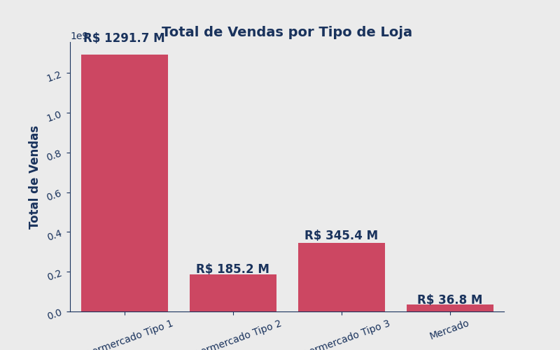
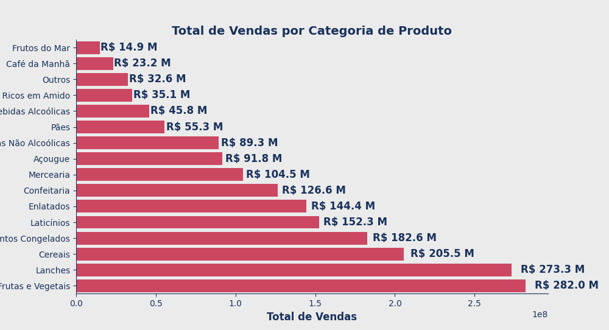
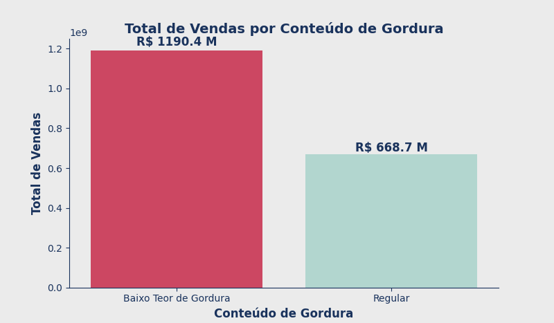

<h1 align="center"> 
	Análise de dados com Python: utilizando o ChatGPT como assistente.
</h1>

Aula 01 - Acesso aos Dados - 

- Utilizar a IA do ChatGPT como assistente;
- Acessar dados em arquivos JSON com Python;
- Trabalhar com a biblioteca Pandas para importar os dados;
- Construir prompts úteis para obter os melhores resultados no ChatGPT.

Aula 02 - Exploração de dados

- Estudar e analisar os dados que possuímos;
- Identificar inconsistências no conjunto de dados que afetem negativamente uma análise;
- Utilizar o ChatGPT para nos ajudar nas análises e decisões dentro do projeto; e
- Consultar o ChatGPT para fazer pesquisas e buscar referências.

Aula 03 - Limpeza e Tratamento

- Principais tipos de dados quantitativos nominais e ordinais;
- Tratamento de dados duplicados;
- Correção de dados categóricos; 
- Funções `dropna` e `fillna`

Aula 04 - Visualização de dados

- Selecionar visualizações que podem ser úteis para o contexto do problema;
- Utilizar o ChatGPT para gerar ideias e códigos que contribuam com a conclusão do projeto;
- Criar prompts estruturados para criar visualizações; e
- Analisar visualizações gráficas.

# Análise de Vendas

Esse gráfico ilustra a relação entre o total de vendas por tipo de loja

Esse gráfico ilustra a relação entre o total de vendas por categoria de produtos

Esse gráfico ilustra a relação entre o total de vendas por conteúdo de gordura

